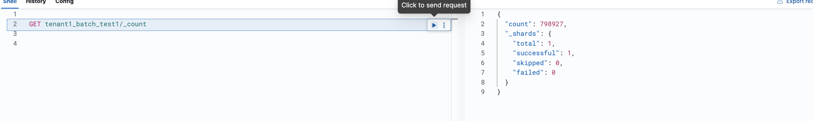

# Deployment / Installation Guide

To Download the dataset

```
cd data
./download_and_extract.sh 
```
## Download the pip requirements


```
cd code
pip install -r requirements.txt
```

## Start the core data management system
```
cd code/coredms
./run.sh
```


## Running for batch ingestion
```bash
cd .
run python3 batchingestmanager.py
```

Afterwards, the tasks for tenant 1 and 2 will be scheduled. It is now configured to run every one or 2 minutes (for testing purpose). After it runs, the data for tenant1 will be available at http://localhost:5601/app/dev_tools#/console/shell for viewing. You can do it like this:




## Running for stream ingestion
```bash
cd streaming
./run.sh
cd .

run python3 producer.py
run python3 streamingestmanager.py
```

Afterwards, the tasks for tenant 1 and 2 will be scheduled. It is now configured to run every one or 2 minutes (for testing purpose). After it runs, the data for tenant1 will be available at http://localhost:5601/app/dev_tools#/console/shell for viewing. You can do it like this:


